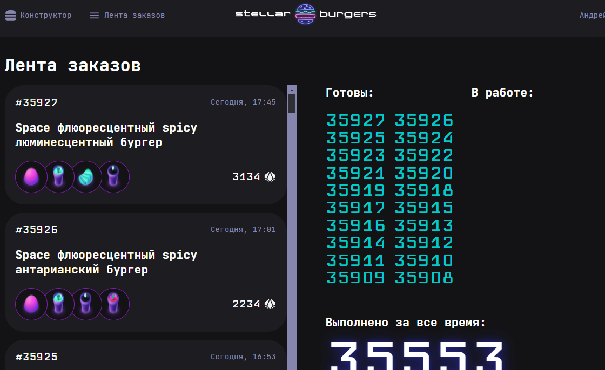

#  Проектная работа "Космическая бургерная Stellar Burgers"

### Описание проекта

* Приложение в котором пользователи могут собрать свой бургер из ингридиентов, отправить заказ. Также пользователь может посмотреть общую ленту заказов, детальную информацию по каждому заказу и отследить статус приготовления своего бургера. 
## Используемые технологии
* Используемый язык программирования TypeScript
* Используемый фреймворк ReactJS
* Реализована регистрация/авторизация пользователя.
* Функционал страницы "Лента заказов" реализован с помощью WebSocket
* Навигация приложения с помощью библиотеки React Router Dom
* Управление состоянияем компонентов реализовано с помощью Redux
* Тестирование приложения осуществляет Jest, Cypress

## Скриншоты приложения

  
 

## Ссылка на приложение: 

https://andrey-kordik.github.io/react-burger/
